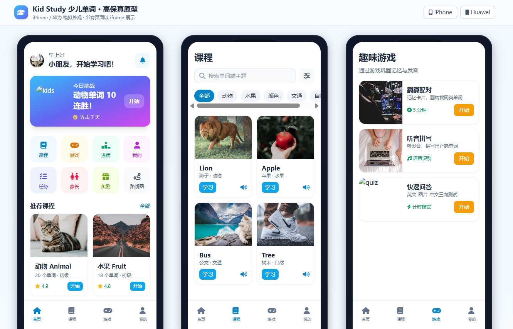
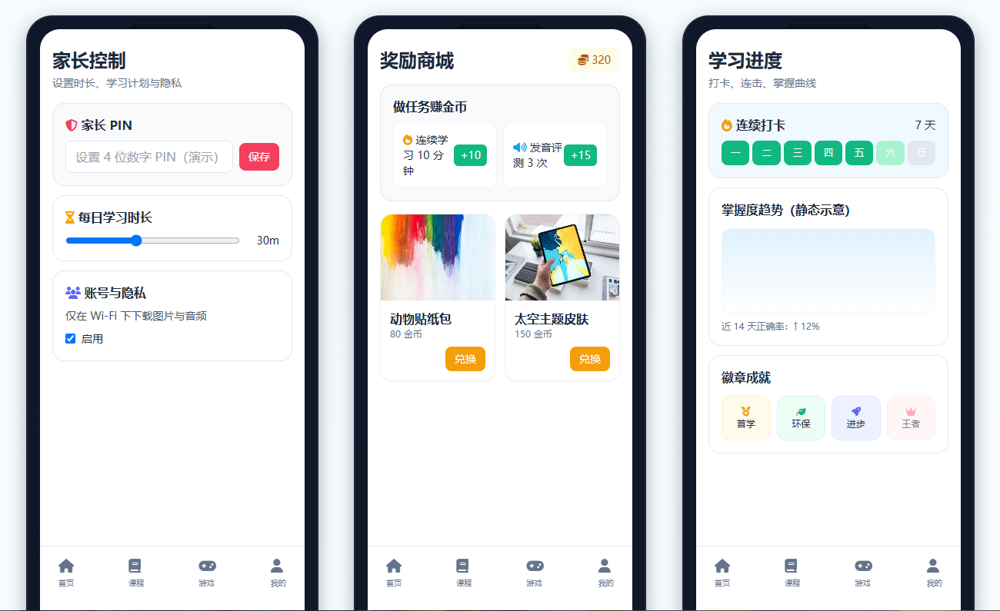
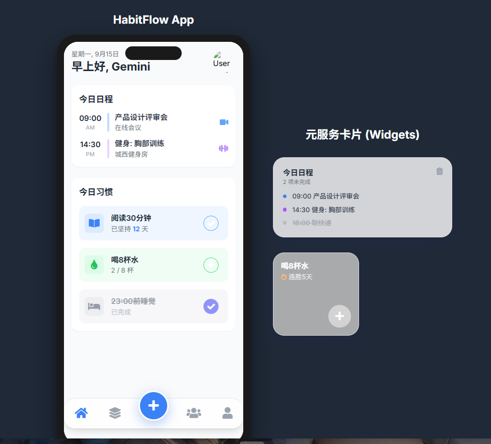
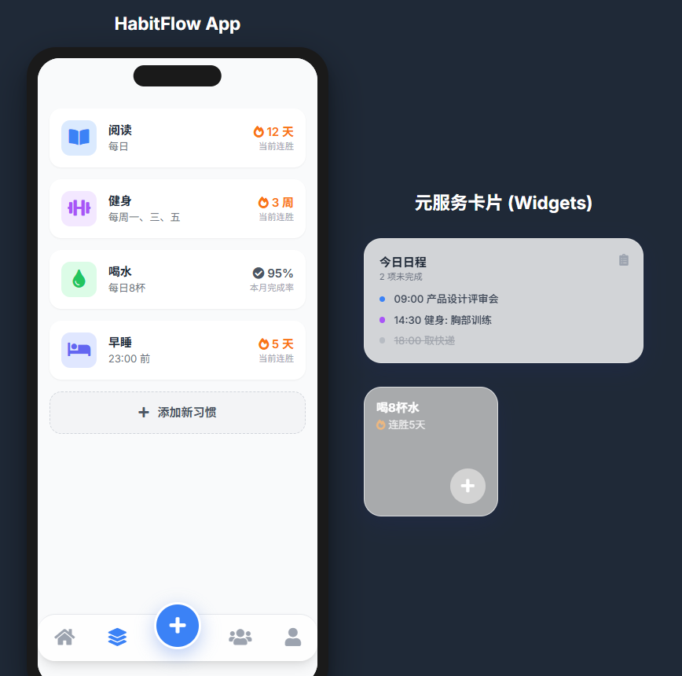
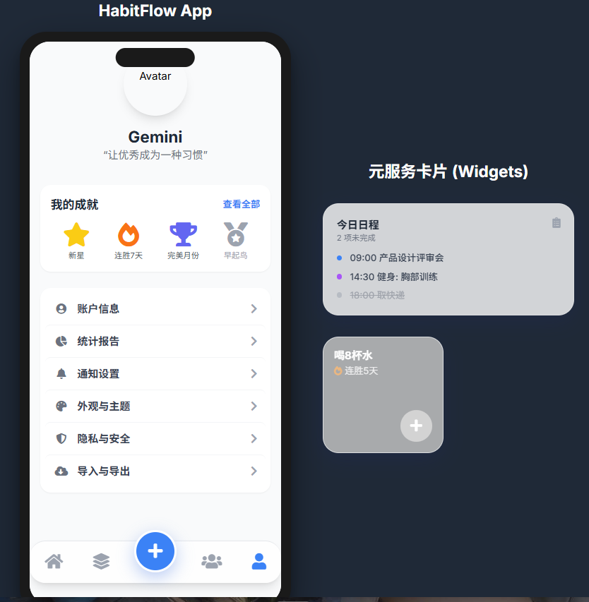

# Kid Study - 儿童学习应用高保真原型

一个专为儿童设计的智能学习应用，包含单词学习、游戏互动、进度跟踪和家长控制等功能模块。项目采用高保真原型设计，支持iPhone和华为设备外观展示。

## 📱 项目展示

### 主应用界面

*主应用首页展示，包含学习进度和功能入口*


*课程学习页面，提供丰富的学习内容*

### Gemini AI 集成模块

*Gemini AI 智能助手界面*


*AI 驱动的个性化学习体验*


*智能推荐和互动功能*

## 🚀 功能特性

### 核心学习功能
- **📚 单词学习**: 互动式单词记忆系统
- **🎮 游戏化学习**: 寓教于乐的学习游戏
- **📊 进度跟踪**: 详细的学习数据统计
- **🔄 复习系统**: 智能错题本和复习计划
- **📖 绘本跟读**: AI语音识别跟读功能

### 智能功能
- **🤖 Gemini AI集成**: 智能学习助手
- **🎯 个性化推荐**: 基于学习数据的智能推荐
- **📱 多设备适配**: 支持iPhone和华为设备外观
- **👨‍👩‍👧‍👦 家长控制**: 完善的家庭管理功能

### 用户体验
- **🎨 高保真设计**: 精美的UI/UX设计
- **⚡ 流畅动画**: GSAP驱动的流畅动画效果
- **📱 响应式布局**: 完美适配各种屏幕尺寸
- **🔊 语音交互**: 支持语音学习和AI对话

## 🏗️ 项目结构

```
kid-study/
├── 📁 assets/                    # 静态资源
│   ├── css/                     # 样式文件
│   │   ├── device.css          # 设备样式
│   │   └── device-huawei.css   # 华为设备样式
│   └── js/                     # JavaScript文件
│       └── anim.js             # 动画效果
├── 📁 gemini/                   # Gemini AI 模块
│   ├── habits.html             # 习惯管理
│   ├── home.html               # AI助手首页
│   ├── index.html              # 模块入口
│   ├── me.html                 # 个人中心
│   ├── mood-journal-modal.html # 心情日记
│   ├── stats.html              # 数据统计
│   ├── style.css               # 样式文件
│   └── teams.html              # 团队协作
├── 📁 pages/                    # 主要页面
│   ├── ai-speech.html          # AI语音功能
│   ├── games.html              # 游戏页面
│   ├── home.html               # 应用首页
│   ├── lessons.html            # 课程学习
│   ├── me.html                 # 个人中心
│   ├── parents.html            # 家长控制
│   ├── progress.html           # 学习进度
│   ├── review.html             # 复习系统
│   ├── rewards.html            # 奖励商城
│   ├── roadmap.html            # 课程路线图
│   ├── storybook.html          # 绘本跟读
│   └── tasks.html              # 任务中心
├── 📁 smart-reminder/           # 智能提醒模块
│   ├── assets/                 # 模块资源
│   ├── index.html              # 模块入口
│   └── pages/                  # 子页面
│       ├── focus.html          # 专注模式
│       ├── habits.html         # 习惯管理
│       ├── home.html           # 首页
│       ├── onboarding.html     # 引导页面
│       ├── schedule.html       # 日程管理
│       ├── settings.html       # 设置页面
│       ├── stats.html          # 数据统计
│       ├── strategies.html     # 智能策略
│       ├── tasks.html          # 任务管理
│       └── widgets.html        # 桌面小组件
├── 📁 image/                    # 项目截图
├── index.html                   # 主入口文件
└── README.md                    # 项目说明
```

## 🛠️ 技术栈

### 前端技术
- **HTML5**: 语义化标记
- **CSS3**: 现代样式设计
- **Tailwind CSS**: 实用优先的CSS框架
- **JavaScript**: 原生ES6+语法
- **GSAP**: 高性能动画库

### 设计工具
- **响应式设计**: 移动优先的设计理念
- **设备模拟**: iPhone和华为设备外观
- **高保真原型**: 接近真实应用的视觉体验

### AI集成
- **Gemini AI**: Google的先进AI模型
- **智能对话**: 自然语言处理
- **个性化推荐**: 机器学习算法

## 🚀 快速开始

### 环境要求
- 现代浏览器 (Chrome, Firefox, Safari, Edge)
- 本地服务器 (推荐使用 Live Server)

### 安装步骤

1. **克隆仓库**
   ```bash
   git clone https://github.com/lingrany/KidApp-Study.git
   cd KidApp-Study
   ```

2. **启动本地服务器**
   ```bash
   # 使用 Python (如果已安装)
   python -m http.server 8000
   
   # 或使用 Node.js
   npx serve .
   
   # 或使用 VS Code Live Server 扩展
   ```

3. **访问应用**
   - 打开浏览器访问 `http://localhost:8000`
   - 或直接双击 `index.html` 文件

### 设备切换
- 点击页面右上角的 **iPhone** 或 **Huawei** 按钮
- 实时切换设备外观展示效果

## 📱 页面说明

### 主要功能页面

| 页面 | 文件路径 | 功能描述 |
|------|----------|----------|
| 🏠 首页 | `pages/home.html` | 应用主入口，显示学习概览 |
| 📚 课程 | `pages/lessons.html` | 单词学习和课程内容 |
| 🎮 游戏 | `pages/games.html` | 互动学习游戏 |
| 👨‍👩‍👧‍👦 家长 | `pages/parents.html` | 家长控制面板 |
| 🏆 奖励 | `pages/rewards.html` | 奖励商城系统 |
| 📊 进度 | `pages/progress.html` | 学习数据统计 |
| 👤 我的 | `pages/me.html` | 个人中心和设置 |

### 高级功能页面

| 页面 | 文件路径 | 功能描述 |
|------|----------|----------|
| 🗺️ 路线图 | `pages/roadmap.html` | 课程学习路径 |
| ✅ 任务 | `pages/tasks.html` | 每日学习任务 |
| 📝 复习 | `pages/review.html` | 错题本和复习 |
| 📖 绘本 | `pages/storybook.html` | 绘本跟读功能 |
| 🎤 AI语音 | `pages/ai-speech.html` | AI语音交互 |

### Gemini AI 模块

| 页面 | 文件路径 | 功能描述 |
|------|----------|----------|
| 🤖 AI首页 | `gemini/home.html` | AI助手主界面 |
| 📊 数据统计 | `gemini/stats.html` | AI分析的学习数据 |
| 📝 心情日记 | `gemini/mood-journal-modal.html` | 情感跟踪功能 |
| 👥 团队协作 | `gemini/teams.html` | 多人学习协作 |

### 智能提醒模块

| 页面 | 文件路径 | 功能描述 |
|------|----------|----------|
| 🔔 智能提醒 | `smart-reminder/index.html` | 提醒系统主界面 |
| 📅 日程管理 | `smart-reminder/pages/schedule.html` | 学习计划安排 |
| 🎯 专注模式 | `smart-reminder/pages/focus.html` | 番茄钟专注工具 |
| 📈 策略优化 | `smart-reminder/pages/strategies.html` | 智能提醒策略 |

## 🎨 设计特色

### 视觉设计
- **🎨 现代UI**: 简洁美观的界面设计
- **🌈 丰富色彩**: 适合儿童的色彩搭配
- **📱 设备适配**: iPhone和华为设备完美展示
- **✨ 动画效果**: 流畅的过渡和交互动画

### 用户体验
- **👶 儿童友好**: 专为儿童设计的交互方式
- **🔊 多感官学习**: 视觉、听觉、触觉结合
- **🎮 游戏化**: 寓教于乐的学习体验
- **📊 数据可视化**: 直观的学习进度展示

## 🤝 贡献指南

欢迎为项目做出贡献！请遵循以下步骤：

1. **Fork** 本仓库
2. 创建功能分支 (`git checkout -b feature/AmazingFeature`)
3. 提交更改 (`git commit -m 'Add some AmazingFeature'`)
4. 推送到分支 (`git push origin feature/AmazingFeature`)
5. 创建 **Pull Request**

### 开发规范
- 使用语义化的提交信息
- 保持代码风格一致
- 添加必要的注释说明
- 测试新功能的兼容性

## 📄 许可证

本项目采用 MIT 许可证 - 查看 [LICENSE](LICENSE) 文件了解详情。

## 📞 联系方式

- **项目链接**: [https://github.com/lingrany/KidApp-Study](https://github.com/lingrany/KidApp-Study)
- **问题反馈**: [Issues](https://github.com/lingrany/KidApp-Study/issues)

## 🙏 致谢

感谢以下开源项目的支持：
- [Tailwind CSS](https://tailwindcss.com/) - CSS框架
- [GSAP](https://greensock.com/gsap/) - 动画库
- [Font Awesome](https://fontawesome.com/) - 图标库
- [Google Gemini](https://ai.google.dev/) - AI模型

---

⭐ 如果这个项目对您有帮助，请给个Star支持一下！
